<div align="center">

# 🛡️ Dark Phantom Nero (V7.1 Apex)
### Sovereign Deep-Tech Intelligence Engine & Autonomous POC Foundry

> **"Transforming fragmented global scientific signals and private market filings into sovereign strategic intelligence, pre-company formation radar, and functional software prototypes at machine speed."**

[](https://python.org)
[](https://github.com/langchain-ai/langgraph)
[](https://github.com/facebookresearch/faiss)
[](https://aws.amazon.com)
[](https://opentelemetry.io)
[](https://www.docker.com)
[](https://developer.mozilla.org/en-US/docs/Web/API/WebSockets_API)

[](https://github.com/techieguy-kartik/self-agent/actions/workflows/weekly_agent.yml)
[](https://github.com/techieguy-kartik/self-agent/actions/workflows/private-market-sync.yml)
[](https://github.com/techieguy-kartik/self-agent/actions/workflows/commercial-data-sync.yml)

</div>

---

## 📑 Table of Contents
1. [Executive Overview & Dual Core Intelligence](#-executive-overview--dual-core-intelligence)
2. [Master System Architecture](#-master-system-architecture)
3. [The 19-Node Autonomous Intelligence Cycle](#-the-19-node-autonomous-intelligence-cycle)
4. [Private Market Intelligence & Formation Radar (Node 19)](#-private-market-intelligence--formation-radar-node-19)
   - [Exit Watch: Pre-Company Formation Detection](#-exit-watch-pre-company-formation-detection)
   - [Form D Daily EDGAR Index Sweep & Self-Healing CIK Resolver](#-form-d-daily-edgar-index-sweep--self-healing-cik-resolver)
   - [Zero-LLM Action Brief Engine & Relationship Diffing](#-zero-llm-action-brief-engine--relationship-diffing)
   - [Commercial Signals: Exec Moves, Export Controls & Diaspora](#-commercial-signals-exec-moves-export-controls--diaspora)
5. [4-Tier Temporal Memory Bus](#-4-tier-temporal-memory-bus)
6. [Bi-Temporal Fact Store & Contradiction Invalidation](#-bi-temporal-fact-store--contradiction-invalidation)
7. [GraphRAG Hybrid Fusion & Knowledge Graph Traversal](#-graphrag-hybrid-fusion--knowledge-graph-traversal)
8. [AsyncIO Concurrency & Semaphore Rate Limiter](#-asyncio-concurrency--semaphore-rate-limiter)
9. [Advanced RAG: HyDE & Maximal Marginal Relevance (MMR)](#-advanced-rag-hyde--maximal-marginal-relevance-mmr)
10. [5-Stage Autonomous POC Foundry & Constitutional Critic](#-5-stage-autonomous-poc-foundry--constitutional-critic)
11. [Confidence Calibration: Brier Score & Isotonic Regression](#-confidence-calibration-brier-score--isotonic-regression)
12. [Dual Embedding Registry: Zero-Downtime Migration](#-dual-embedding-registry-zero-downtime-migration)
13. [Observability: OpenTelemetry, Prometheus & WebSocket Streaming](#-observability-opentelemetry-prometheus--websocket-streaming)
14. [Analytical Cores & Specialized Engines](#-analytical-cores--specialized-engines)
15. [12 Frontier Research Domains](#-12-frontier-research-domains)
16. [Sovereign AWS Infrastructure & Data Lake Topology](#-sovereign-aws-infrastructure--data-lake-topology)
17. [Bug Forensics & Remediation Matrix (V7.0 & V7.1)](#-bug-forensics--remediation-matrix-v70--v71)
18. [Enterprise REST & WebSocket API Reference](#-enterprise-rest--websocket-api-reference)
19. [Production Deployment & GitHub Actions Mesh](#-production-deployment--github-actions-mesh)
20. [Configuration & Environment Variable Matrix](#-configuration--environment-variable-matrix)

---

## 🔬 Executive Overview & Dual Core Intelligence

**Dark Phantom Nero** is an institutional-grade, multi-agent intelligence operating system designed for defense researchers, sovereign wealth funds, and deep-tech venture studios.

Unlike passive news aggregators, feed readers, or conversational LLM wrappers, Dark Phantom Nero operates as an **autonomous, dual-core intelligence apparatus**:

```
                       ┌──────────────────────────────────────────────┐
                       │           DARK PHANTOM NERO V7.1             │
                       └──────────────────────┬───────────────────────┘
                                              │
                    ┌─────────────────────────┴─────────────────────────┐
                    ▼                                                   ▼
     ┌─────────────────────────────┐                     ┌─────────────────────────────┐
     │      CORE 1: SCIENTIFIC     │                     │     CORE 2: PRIVATE MARKET  │
     │      R&D INTELLIGENCE       │                     │       FORMATION RADAR       │
     │  (Nodes 1-18 Master DAG)    │                     │  (Node 19 Master Pipeline)  │
     ├─────────────────────────────┤                     ├─────────────────────────────┤
     │ • 12 Frontier Tech Domains  │                     │ • EDGAR Form D Daily Index  │
     │ • arXiv & Crossref Papers   │                     │ • Exit Watch (Alumni Radar) │
     │ • USPTO & Google Patents    │                     │ • Trade Press Precision RSS │
     │ • USAspending & SBIR Awards │                     │ • SEC 8-K Executive Changes │
     │ • Citation Deserts & Gaps   │                     │ • BIS/OFAC Export Controls  │
     │ • 5-Stage Autonomous POC    │                     │ • Zero-LLM Action Brief     │
     └─────────────────────────────┘                     └─────────────────────────────┘
```

- **Scientific Discovery (3-18 Months Pre-Hype)**: Identifies breakthrough physical and algorithmic discoveries across global academic preprints, USPTO patent claims, and federal contracts before they reach commercial consensus.
- **Formation Radar (6-18 Months Pre-Press Release)**: Mines SEC EDGAR daily filing indices for newly incorporated companies raising capital under Regulation D, cross-referencing founder names against patent-backed alumni pedigrees.
- **Autonomous Proof-of-Concept Foundry**: Automatically generates complete, production-grade software repositories (CUDA kernels, PyTorch architectures, distributed agents) for high-value technical opportunities.
- **Bi-Temporal Memory with Zero Hallucination**: Tracks state transitions over dual timelines (real-world event time vs ingestion observation time) with automated contradiction invalidation.

---

## 🏛️ Master System Architecture

```mermaid
graph TB
    subgraph SignalHarvesting["📡 Multi-Source Sensor Ingestion"]
        S1["arXiv CS/Quant-ph/Bio/Physics"]
        S2["USPTO & Google Patent Filings"]
        S3["USAspending Contract & Grant Awards"]
        S4["SEC EDGAR Form D Daily Index"]
        S5["SEC 8-K Item 5.02 Filings"]
        S6["Frontier Trade Press RSS Feeds"]
        S7["BIS / OFAC / State Export Lists"]
        S8["GitHub Trending & HackerNews"]
    end

    subgraph AsyncPipeline["⚡ AsyncIO Pipeline Orchestration"]
        AP1["Domain Shard Dispatcher"]
        AP2["AsyncLLMClient (Semaphore Pool)"]
        AP3["Sliding Window Token Budget"]
        AP4["Key Rotation Manager"]
    end

    subgraph MemoryBus["🧠 4-Tier Temporal Memory Bus"]
        T1["Tier 1: Working Memory (SQLite State)"]
        T2["Tier 2: Episodic Facts (Bi-Temporal WAL)"]
        T3["Tier 3: Semantic Vectors (FAISS IndexIDMap)"]
        T4["Tier 4: Relational Graph (SQLite Decay Graph)"]
    end

    subgraph AnalysisEngines["🔬 Deep Analytical Cores"]
        A1["Stanford Deception Detector"]
        A2["Competitive Moat Profiler"]
        A3["Blind Spot & Citation Radar"]
        A4["Confidence Calibrator (Brier)"]
        A5["Action Brief Diff Engine (Zero-LLM)"]
        A6["Exit Watch Pedigree Scorer"]
    end

    subgraph SynthesisAndPOC["🛠️ Synthesis & Autonomous Foundry"]
        SYN["GraphRAG Hybrid Fusion"]
        CRIT["Constitutional AI Critic"]
        POC["5-Stage POC Autonomous Builder"]
    end

    subgraph OutputDistribution["📡 Sovereign Cloud Fabric & Streaming"]
        OUT1["WebSocket Server (:8001)"]
        OUT2["Prometheus Metrics (:9090)"]
        OUT3["Flask REST API (:5000)"]
        OUT4["React Intelligence Dashboard"]
        OUT5["AWS S3 Sovereign Data Lake"]
        OUT6["DynamoDB Continuous State"]
        OUT7["Encrypted Telegram Dispatcher"]
    end

    SignalHarvesting --> AsyncPipeline
    AsyncPipeline --> MemoryBus
    MemoryBus <--> AnalysisEngines
    AnalysisEngines --> SynthesisAndPOC
    SynthesisAndPOC --> OutputDistribution
```

---

## 🔄 The 19-Node Autonomous Intelligence Cycle

The master intelligence engine in [`agent/news_agent.py`](file:///Users/apple/Downloads/research-agent/self-agent/agent/news_agent.py) executes as a fault-tolerant Directed Acyclic Graph (DAG) via LangGraph. Each node is isolated with its own exception handlers, telemetry spans, and checkpoint saves:

```mermaid
flowchart TD
    N1["Node 1: Env & Secret Bootstrap"] --> N2["Node 2: Multi-Domain Parallel Harvesting"]
    N2 --> N3["Node 3: Entity Resolution & Canonicalization"]
    N3 --> N4["Node 4: Temporal Fact Extraction & Contradiction Check"]
    N4 --> N5["Node 5: Knowledge Graph Neighborhood Traversal"]
    N5 --> N6["Node 6: Semantic Vector Ingestion (Dual Model)"]
    N6 --> N7["Node 7: Multi-Domain Synthesis & Thesis Generation"]
    N7 --> N8["Node 8: Stanford Linguistic Deception Scoring"]
    N8 --> N9["Node 9: Competitive Moat & Blue Ocean Profiling"]
    N9 --> N10["Node 10: Citation Desert & Blind Spot Discovery"]
    N10 --> N11["Node 11: Cross-Domain Intersect Analysis"]
    N11 --> N12["Node 12: Opportunity Scoring & Ranking"]
    N12 --> N13["Node 13: Constitutional AI Self-Critic Evaluation"]
    N13 --> N14["Node 14: Autonomous POC Foundry Dispatch"]
    N14 --> N15["Node 15: Memory Compaction & SQLite VACUUM"]
    N15 --> N16["Node 16: Telemetry Spans & Metric Push"]
    N16 --> N17["Node 17: Presentation Mirror & JSON Assembly"]
    N17 --> N18["Node 18: GitHub Issue Publishing & Notification"]
    N18 --> N19["Node 19: Private Market Intelligence & Formation Radar"]
    N19 --> END(["🏁 Pipeline Cycle Complete"])

    style N19 fill:#1f2430,stroke:#00e676,stroke-width:3px,color:#fff
```

---

## 🛰️ Private Market Intelligence & Formation Radar (Node 19)

V7.1 adds a dedicated commercial intelligence layer to Dark Phantom Nero. It operates without blocking the academic pipeline and writes directly to your AWS S3 sovereign data lake and DynamoDB state store with **zero git commits from agent runs**.

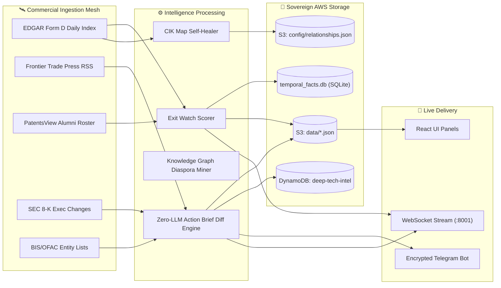

### 🎯 Exit Watch: Pre-Company Formation Detection
- **File**: [`agent/collectors/private_market.py`](file:///Users/apple/Downloads/research-agent/self-agent/agent/collectors/private_market.py)
- **Problem**: Startups announce funding 6 to 18 months after legal incorporation and first capital close. Waiting for TechCrunch or PR Newswire is too late for proprietary sourcing.
- **Mechanism**:
  1. Sweeps SEC EDGAR daily index for all Regulation D (`Form D` and `Form D/A`) filings.
  2. Parses XML payloads for named executive officers, directors, and capital raised.
  3. Cross-references officers against two high-conviction databases:
     - **Known Founders**: Entity database of all covered frontier-tech companies.
     - **Patent Alumni Roster**: Public patent inventor records from elite institutions (SpaceX, Anduril, Palantir, OpenAI, DeepMind, Tesla, Google, Apple, NVIDIA).
  4. Classifies each filing into a confidence tier:
     - `CONFIRMED`: Officer matches a documented founder in our knowledge graph.
     - `PROBABLE`: Officer has patent-documented R&D history at a pedigree institution.
     - `WATCH`: New frontier-tech entity raising real capital ($\ge \$100\text{K}$).
  5. Stores confirmed signals as bi-temporal facts in `temporal_facts.db` and broadcasts via WebSocket.

### 📡 Form D Daily EDGAR Index Sweep & Self-Healing CIK Resolver
- **100% Coverage**: Rather than querying a static list of known CIKs (which misses newly incorporated entities), Dark Phantom Nero parses the complete quarterly EDGAR `company.idx` stream daily.
- **3-Tier Match Precision**:
  - `CIK`: Exact match against known entity CIK.
  - `Founder`: Name stems match and a named officer matches founder records.
  - `Name-Strict`: Stem match $\ge 6$ characters (sent to review queue, never published unverified).
- **Self-Healing Architecture**: When an officer match verifies a new CIK for a known company, the engine automatically updates `s3://news-agent-377131740229/config/cik_map.json`, permanently elevating future filing detection to instant Tier-1 certainty.

### 📋 Zero-LLM Action Brief Engine & Relationship Diffing
- **File**: [`agent/analysis/action_brief_engine.py`](file:///Users/apple/Downloads/research-agent/self-agent/agent/analysis/action_brief_engine.py)
- **Zero Hallucination Guarantee**: Built strictly with retrieval, hashing, and relational weighting algorithms. **Zero LLM tokens are invoked**, completely eliminating synthetic fabrication risk.
- **Relationship Weighting**: Reads private relationship tiers from `s3://news-agent-377131740229/config/relationships.json`:
  $$\text{Score} = \text{Base Weight} \times \text{Tier Multiplier} \quad (\text{Portfolio}=3.0\times, \, \text{Visited}=2.0\times, \, \text{Covered}=1.5\times)$$
- **DynamoDB State Diffing**: Fingerprints every incoming event (`SHA-256(accession | url | company | title)`). Only net-new events are surfaced each morning.
- **Route Tagging**: Buckets items into actionable channels (`fund`, `article`, `podcast`). Unrouted items are filtered out to protect attention bandwidth.

### 🌐 Commercial Signals: Exec Moves, Export Controls & Diaspora
- **File**: [`agent/collectors/commercial_signals.py`](file:///Users/apple/Downloads/research-agent/self-agent/agent/collectors/commercial_signals.py)
- **Executive Changes**: Parses SEC 8-K Item 5.02 filings for C-suite departures and appointments.
- **Export Controls Watch**: Cross-references covered company entity graphs against BIS Consolidated Screening Lists (Entity List, OFAC SDN, State Department ITAR).
- **Founder Diaspora**: Mines 2-hop relational neighborhoods in `knowledge_graph.db` to identify company spin-outs and alumni clusters emerging from major aerospace and defense primes.

---

## 🧠 4-Tier Temporal Memory Bus

Dark Phantom Nero uses a 4-tier memory hierarchy designed to replicate human cognitive consolidation while retaining deterministic, queryable audit trails:

```mermaid
graph LR
    subgraph Tier1["Tier 1: Working Memory"]
        W1["Ephemeral Session State"]
        W2["Scratchpad Notes"]
        W3["SQLite Crash Resilience"]
    end

    subgraph Tier2["Tier 2: Episodic Memory"]
        E1["Bi-Temporal Facts"]
        E2["Valid_From / Valid_To"]
        E3["Auto-Invalidation Engine"]
    end

    subgraph Tier3["Tier 3: Semantic Memory"]
        S1["FAISS Vector Index (IndexIDMap)"]
        S2["pgvector HNSW (50K+ Docs)"]
        S3["HyDE + MMR Query Unit"]
    end

    subgraph Tier4["Tier 4: Archive Memory"]
        A1["SQLite Knowledge Graph"]
        A2["Entity Nodes & Links"]
        A3["90-Day Half-Life Weight Decay"]
    end

    Tier1 -->|Consolidate| Tier2
    Tier2 -->|Vectorize| Tier3
    Tier3 -->|Entity Link| Tier4
```

| Memory Tier | Storage Engine | Read Latency | Write Latency | Retention Policy | Primary Use Case |
|---|---|---|---|---|---|
| **Tier 1: Working** | In-Process + SQLite | < 0.5 ms | < 2 ms | Current Run | Scratch notes, active node context, task queue |
| **Tier 2: Episodic** | SQLite WAL | < 2 ms | < 5 ms | Persistent | Bi-temporal facts, entity claims, Form D rounds |
| **Tier 3: Semantic** | FAISS / pgvector | < 15 ms | < 30 ms | Long-term | High-dimensional semantic search, paper abstracts |
| **Tier 4: Archive** | SQLite Graph DB | < 8 ms | < 10 ms | Indefinite | Relational graph, supplier chains, team networks |

---

## ⏰ Bi-Temporal Fact Store & Contradiction Invalidation

Every fact stored in [`agent/memory/temporal_facts.py`](file:///Users/apple/Downloads/research-agent/self-agent/agent/memory/temporal_facts.py) tracks two separate timelines:
1. **World Time (`valid_from` to `valid_to`)**: When the fact was objectively true in the real world.
2. **Ingestion Time (`ingested_at`)**: When our pipeline first observed and recorded it.

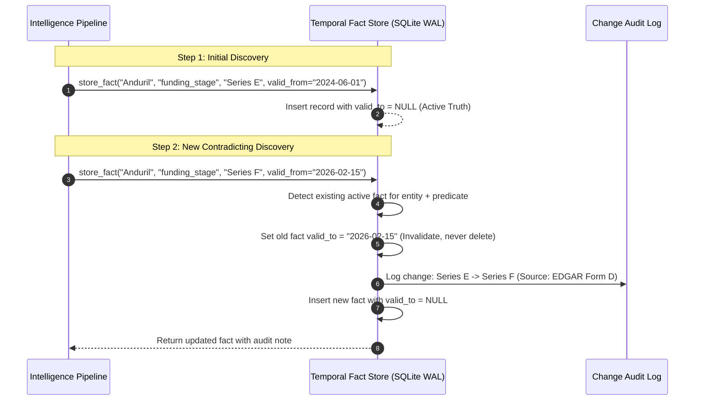

---

## 🧬 GraphRAG Hybrid Fusion & Knowledge Graph Traversal

[`agent/rag/graph_rag_fusion.py`](file:///Users/apple/Downloads/research-agent/self-agent/agent/rag/graph_rag_fusion.py) unifies high-dimensional vector search with structured entity relation traversal:

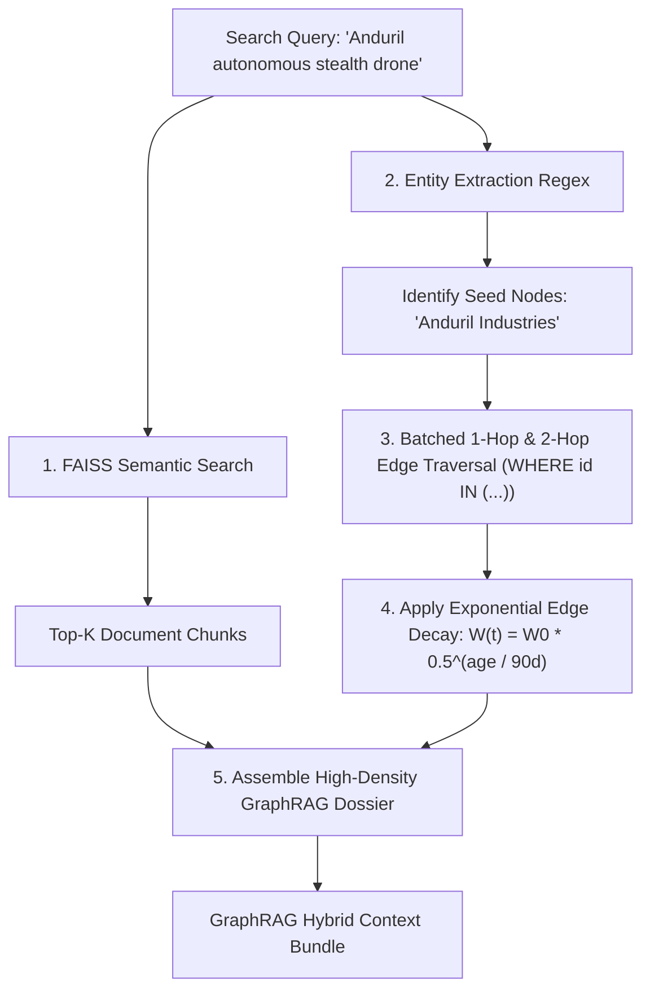

---

## ⚡ AsyncIO Concurrency & Semaphore Rate Limiter

The async engine in [`agent/infra/async_llm_client.py`](file:///Users/apple/Downloads/research-agent/self-agent/agent/infra/async_llm_client.py) enables parallel harvesting across all 12 domains without exceeding API token-per-minute (TPM) limits:

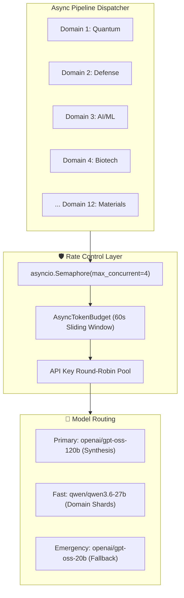

---

## 🔍 Advanced RAG: HyDE & Maximal Marginal Relevance (MMR)

Implemented in [`agent/rag/retriever.py`](file:///Users/apple/Downloads/research-agent/self-agent/agent/rag/retriever.py):

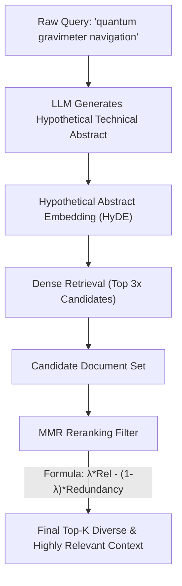

---

## 🛠️ 5-Stage Autonomous POC Foundry & Constitutional Critic

Implemented in [`agent/poc_agent.py`](file:///Users/apple/Downloads/research-agent/self-agent/agent/poc_agent.py) and [`agent/cloud_worker.py`](file:///Users/apple/Downloads/research-agent/self-agent/agent/cloud_worker.py):

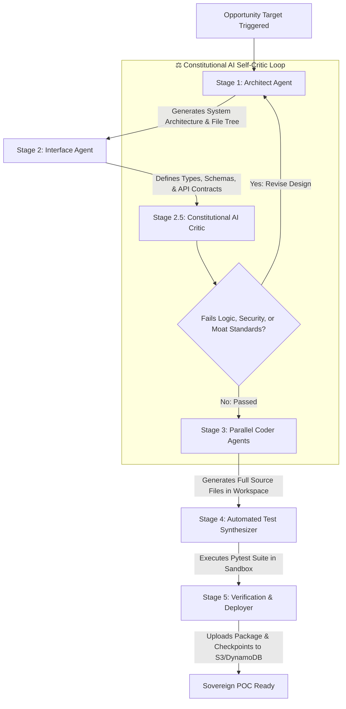

---

## 📐 Confidence Calibration: Brier Score & Isotonic Regression

Located in [`agent/infra/confidence_calibrator.py`](file:///Users/apple/Downloads/research-agent/self-agent/agent/infra/confidence_calibrator.py):

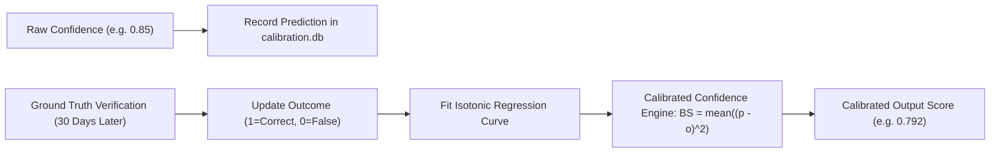

---

## 📋 Dual Embedding Registry: Zero-Downtime Migration

Located in [`agent/rag/embedding_registry.py`](file:///Users/apple/Downloads/research-agent/self-agent/agent/rag/embedding_registry.py):

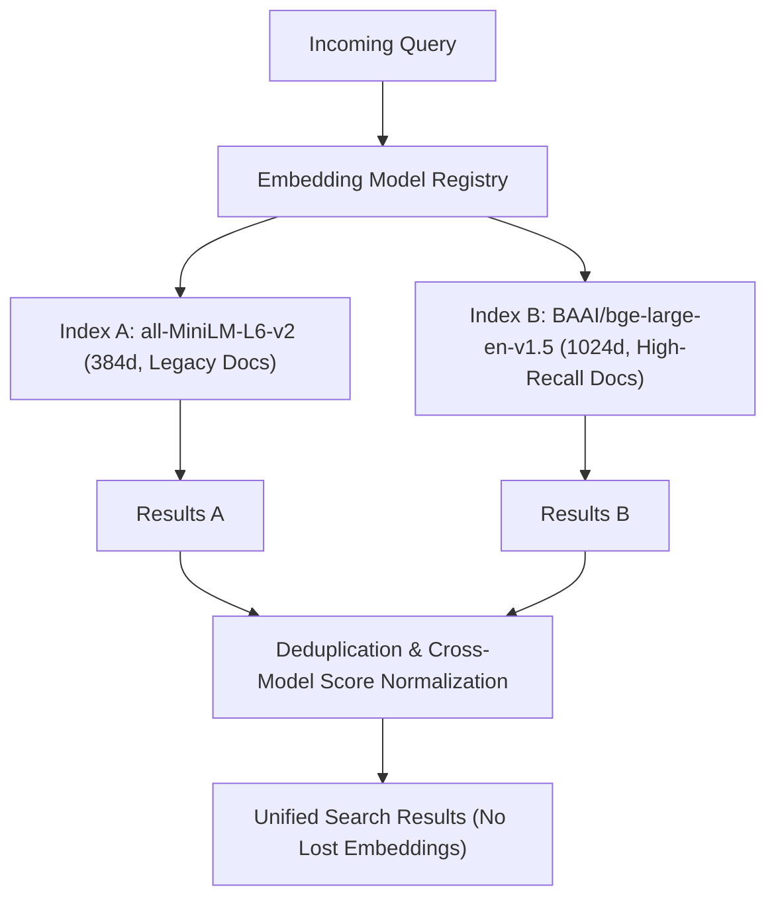

---

## 📊 Observability: OpenTelemetry, Prometheus & WebSocket Streaming

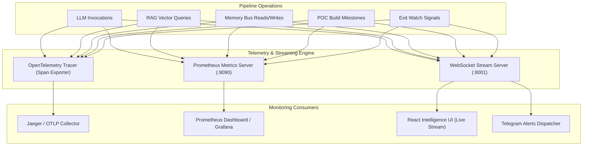

---

## 🔬 Analytical Cores & Specialized Engines

### 1. Stanford Linguistic Deception Detection Engine
- **File**: [`agent/analysis/deception_detector_engine.py`](file:///Users/apple/Downloads/research-agent/self-agent/agent/analysis/deception_detector_engine.py)
- **Methodology**: Analyzes corporate earnings calls, transcripts, and technical defense filings for cognitive evasion indicators:
  - **Hedge Word Density**: Over-saturation of `might`, `approximate`, `potential`.
  - **Self-Referential Pronoun Avoidance**: Distancing language (`the team`, `the initiative` vs `we`, `our`).
  - **Topic Avoidance Count**: Divergence between analyst question vectors and executive response vectors.
  - **Extreme Positive Superlatives**: Overuse of `unprecedented`, `revolutionary` to mask technical delays.

### 2. Competitive Moat Profiler
- **File**: [`agent/analysis/moat_profiler.py`](file:///Users/apple/Downloads/research-agent/self-agent/agent/analysis/moat_profiler.py)
- **Methodology**: Evaluates technological defensibility across 6 orthogonal dimensions:
  - *Network Effects* (data flywheel, developer ecosystem)
  - *Switching Costs* (deep infrastructure entanglement, proprietary protocols)
  - *Cost Advantage* (novel algorithmic efficiency, unique silicon access)
  - *Intangible Assets* (patent defensibility, security clearances)
  - *System Integration Complexity* (multi-domain hardware/software integration)
  - *Capital Efficiency Barrier* (R&D capital requirements to reach parity)

### 3. Blind Spot & Citation Desert Radar
- **File**: [`agent/blindspot_engine.py`](file:///Users/apple/Downloads/research-agent/self-agent/agent/blindspot_engine.py)
- **Methodology**: Identifies areas where high capital flows collide with low peer-reviewed publication rates, signaling either covert sovereign research or market hype bubbles.

---

## 🌐 12 Frontier Research Domains

| Domain | Key Data Sources | Core Target Signals |
|---|---|---|
| **AI/ML & Foundation Models** | ArXiv cs.AI, HuggingFace, NeurIPS | Architecture breakthroughs, inference acceleration, reasoning models |
| **Defense & National Security** | USAspending, DTIC, Jane's Defense, DARPA | Autonomous drone wingmen, hypersonic guidance, radar stealth |
| **Quantum Computing** | ArXiv quant-ph, USPTO, Quantum Insider | Error correction, topological qubits, quantum annealers |
| **Space & Satellites** | NASA TechPort, SpaceNews, FCC filings | LEO constellations, laser communications, orbital propulsion |
| **Semiconductors & Chips** | USPTO, SIA, IEEE Spectrum | Backside power delivery, gate-all-around, advanced packaging |
| **Biotechnology** | PubMed, ClinicalTrials.gov, bioRxiv | mRNA platforms, protein folding models, antibody discovery |
| **Cybersecurity** | CVE Database, CISA Advisories, GitHub | Zero-day vulnerabilities, quantum-resistant encryption, eBPF telemetry |
| **Energy & Climate Tech** | DOE, ArXiv physics, IEA filings | Solid-state batteries, magnetic confinement fusion, microgrids |
| **Robotics & Autonomy** | ArXiv cs.RO, IEEE, DARPA Robotics | Humanoid manipulation, vision-language-action (VLA) models |
| **Neuromorphic & Edge AI** | IEEE Brain, IARPA solicitations | Spiking neural networks, analog matrix multipliers, ultra-low power silicon |
| **Synthetic Biology** | Nature Biotech, NIST, USPTO | DNA data storage, cell-free biomanufacturing, gene circuit logic |
| **Advanced Materials** | ArXiv cond-mat, Materials Project | Metamaterials, 2D superconductors, carbon nanotube composites |

---

## 🗄️ Sovereign AWS Infrastructure & Data Lake Topology

All data storage and pipeline state is maintained strictly in AWS Account `377131740229` in `us-east-1`:

```
s3://news-agent-377131740229/
├── data/                                 # Presentation Mirror for React Dashboard
│   ├── roadmap_schema.json               # Master technology roadmap & heat index
│   ├── run_manifest.json                 # Execution manifest & timestamp
│   ├── action_brief.json                 # Daily relationship-weighted intelligence diff
│   ├── action_brief.md                   # Formatted brief for Telegram delivery
│   ├── form_d_daily.json                 # SEC EDGAR Regulation D raw filings
│   ├── exit_watch.json                   # Pre-company formation radar signals
│   ├── trade_press.json                  # Parsed frontier funding events
│   ├── exec_moves.json                   # C-Suite changes from SEC 8-K
│   ├── export_controls_watch.json        # BIS/OFAC watchlist cross-references
│   ├── founder_diaspora.json             # Mined founder alumni networks
│   └── alumni_roster.json                # Patent-backed pedigree roster
│
├── config/                               # Private Configuration (Never in Git)
│   ├── relationships.json                # User relationship weights & route tags
│   └── cik_map.json                      # Self-healing company CIK map
│
├── history/                              # Rolling Execution Diffs
│   ├── *_history.json                    # Historical domain metrics
│   └── latest/                           # Pointer to most recent cycle outputs
│
├── db/                                   # Durable SQLite WAL Backups
│   ├── knowledge_graph.db                # Relational entity graph
│   ├── temporal_facts.db                 # Bi-temporal fact database
│   ├── core_memory.db                    # Core memory bus
│   ├── agent_memory.db                   # Episodic memory store
│   └── checkpoints.db                    # Task execution checkpoints
│
├── glacier/                              # Long-Term Cold Storage
│   └── manifest.json                     # Deep archive manifest (GLACIER_IR rule)
│
└── vector_index/                         # Dense Embeddings Store
    ├── faiss.index                       # FAISS IndexIDMap binary
    └── metadata.json                     # Vector document metadata
```

---

## 🐛 Bug Forensics & Remediation Matrix (V7.0 & V7.1)

| Bug ID | Severity | File | Root Cause | Remediation Applied |
|---|---|---|---|---|
| **B-01** | 🔴 Critical | `temporal_facts.py` | Connection open/close per query caused WAL lock contention under concurrency | Thread-local SQLite connection pool with pre-configured WAL PRAGMAs |
| **B-02** | 🔴 Critical | `llm_client.py` | Space-splitting prompt truncation corrupted JSON, code blocks, and math | Paragraph-aware boundary compaction preserving structural integrity |
| **B-03** | 🔴 Critical | `llm_client.py` | Non-atomic `open(path, 'w')` created corrupted cache files on abrupt termination | Atomic `os.replace()` write mechanism via POSIX file swap |
| **B-04** | 🟠 High | `checkpoint_store.py` | Synchronous DynamoDB HTTP calls blocked execution pipeline 100-500ms | Non-blocking fire-and-forget daemon sync thread with 400KB payload safeguards |
| **B-05** | 🟠 High | `poc_agent.py` | Naive brace-counting `_looks_complete()` failed on quotes inside JSON strings | Stack-based state machine checking true JSON syntactic closure |
| **B-06** | 🟠 High | `working_memory.py` | Working memory store was in-process only; all session context lost on crash | SQLite-backed backing store for automatic crash recovery |
| **B-07** | 🟠 High | `vector_store.py` | `purge_expired()` rebuilt full index on every delete ($O(N^2)$) | FAISS `IndexIDMap` integration for $O(1)$ constant-time vector deletion |
| **B-08** | 🟡 Medium | `embeddings.py` | Single hardcoded embedding model prevented quality upgrades | Dynamic Embedding Model Registry supporting simultaneous dimensions |
| **B-09** | 🟡 Medium | `deception_detector_engine.py` | Hardcoded `"2026-Q2"` quarter string corrupted historical metadata | Dynamic quarter computation derived from `datetime.date.today()` |
| **B-10** | 🟡 Medium | `memory_consolidator.py` | Regex `r'\b([A-Z][a-zA-Z]+)\b'` captured generic words ("The", "Found") as entities | Stricter 2+ Title Case word regex filter preventing spurious entity generation |
| **B-11** | 🟠 High | `poc_server.py` | Hardcoded `admin/password123` default credentials presented security vulnerability | Cryptographically random `secrets.token_urlsafe(18)` credential generator |
| **B-12** | ⚪ Low | `entity_resolver.py` | Trailing duplicate docstring block caused import noise | Code clean-up and artifact removal |
| **B-13** | 🟠 High | `graph_rag_fusion.py` | Graph traversal ran individual `SELECT` queries per neighbor node ($N+1$ problem) | Batched single-query `WHERE id IN (...)` neighbor resolution |
| **B-14** | 🟠 High | `news_agent.py` | Raw `ChatGroq()` instances bypassed centralized rate limiting | All LLM calls routed strictly through managed `get_llm_client()` singleton |
| **B-15** | 🟡 Medium | `llm_client.py` | `words * 1.3` token heuristic drifted by up to $\pm 25\%$ on code and JSON payloads | `tiktoken` (`cl100k_base`) integration for exact token budgeting |
| **B-NEW-1**| 🔴 Critical | `news_agent.py` | Direct `/tmp/` file reliance caused state wipe in GitHub Actions runners | Switched all artifact saves to atomic S3 PutObject and DynamoDB state |
| **B-NEW-2**| 🟠 High | `s3_client.py` | `get_s3_cache()` hardcoded `cache/` prefix, breaking direct `config/` reads | Added direct S3 key routing for fully qualified file paths |
| **B-NEW-3**| 🟠 High | `private_market.py` | DynamoDB update attempted `pk`/`sk` writes against `domain_date`/`item_id` schema | Aligned partition key (`domain_date`) and sort key (`item_id`) across all collectors |
| **B-NEW-4**| 🟡 Medium | `dynamodb.tf` | Continuous recovery (PITR) was disabled on production DynamoDB tables | Enabled PITR across `deep-tech-intel` and `deep-tech-checkpoints` |
| **B-NEW-5**| 🔴 Critical | `private_market.py` | Anonymous class fallback lambda in headline parser received 2 args (`self` + `1`), raising `TypeError` | Replaced with explicit `_rm = _ROUND_RE.search(title)` and conditional fallback extraction |
| **B-NEW-6**| 🔴 Critical | `cloud_worker.py` | DynamoDB partition key `begins_with` failure combined with missing `--once` caused 45-min infinite loop in CI | 3-Layer fix: DynamoDB `scan` with `FilterExpression`, CI environment auto-exit, and workflow `--once` safety flag |
| **B-NEW-7**| 🟠 High | `ec2.tf` / `iam.tf` | Dynamic SSH key generation threatened to destroy live AWS key pair and overwrite `.pem`; IAM policy name drifted | Static public key reference with `ignore_changes`, IAM policy aligned to `news-agent-ci-policy`, 21 resources imported for zero-drift state |

---

## 🔌 Enterprise REST & WebSocket API Reference

### 1. REST Endpoints (`http://localhost:5000`)

#### Authentication
```http
POST /api/login
Content-Type: application/json

{
  "username": "admin",
  "password": "<see-console-startup-log>"
}
```

#### Run Full Intelligence Pipeline
```http
POST /api/pipeline/run
Content-Type: application/json
Authorization: Bearer <token>

{
  "domains": ["Quantum Computing", "Defense & National Security"],
  "enable_poc": true,
  "run_id": "custom-run-001"
}
```

#### Query Bi-Temporal Facts
```http
GET /api/facts?entity=Anduril%20Industries&predicate=funding_stage
```

#### Get Fact Contradictions & Changes
```http
GET /api/facts/changes?domain=Defense&since_days=30
```

#### Graph Neighborhood Traversal
```http
GET /api/graph?entity=Palantir&hops=2
```

---

### 2. WebSocket Real-Time Stream (`ws://localhost:8001`)

Connect any client to receive structured live events without polling:
```javascript
const ws = new WebSocket("ws://localhost:8001");

ws.onmessage = (event) => {
  const payload = JSON.parse(event.data);
  console.log(`[${payload.type}]`, payload.data);
};
```

**Streamed Event Types (17 Total):**

| Event Type | Subsystem | Trigger Description |
|---|---|---|
| `pipeline_start` | Orchestrator | Pipeline execution initialized |
| `domain_digest` | Research Core | Domain harvest completed for 1 of 12 verticals |
| `new_opportunity` | Opportunity Engine | High-scoring technical whitespace opportunity surfaced |
| `threat_alert` | Deception Core | Linguistic evasion or supply chain risk flagged |
| `blind_spot` | Radar Core | Citation desert or zero-coverage technique identified |
| `memory_update` | Temporal DB | Bi-temporal fact updated or contradiction resolved |
| `rag_query` | RAG Fusion | Hybrid FAISS + Graph retrieval executed |
| `poc_stage` | POC Foundry | Autonomous code generation milestone completed |
| `pipeline_complete` | Orchestrator | Master DAG execution completed |
| `exit_watch_signal` | Formation Radar | **[V7.1]** Form D filing matched against founder/alumni pedigree |
| `form_d_confirmed` | Formation Radar | **[V7.1]** Regulation D filing matched with CIK/founder confidence |
| `trade_press_round` | Trade Press | **[V7.1]** Funding round parsed from frontier technical headline |
| `exec_move` | SEC Watch | **[V7.1]** C-Suite appointment or departure detected via 8-K Item 5.02 |
| `action_brief_ready`| Action Brief | **[V7.1]** Morning relationship-weighted intelligence diff compiled |
| `export_controls` | Compliance Watch | **[V7.1]** Entity match identified on BIS/OFAC consolidated screening list |
| `founder_diaspora` | Graph Core | **[V7.1]** Founder alumni network mined from knowledge graph |
| `error` | System | Pipeline warning or recoverable exception logged |

---

## 🐳 Production Deployment & GitHub Actions Mesh

Dark Phantom Nero deploys as a dual-execution mesh:
1. **GitHub Actions Serverless Runners**: Handles scheduled daily data synchronization, EDGAR index sweeps, and report generation.
2. **EC2 Sovereign Compute Host**: Hosts the persistent REST API, WebSocket server, and React dashboard.

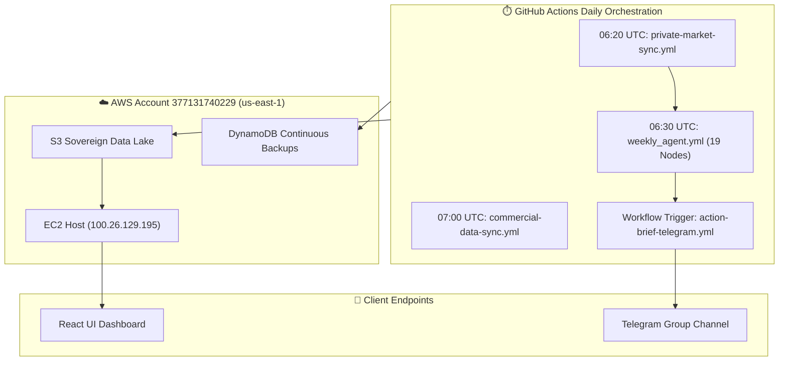

### Quickstart Commands

```bash
# 1. Clone the repository
git clone https://github.com/techieguy-kartik/self-agent.git
cd self-agent

# 2. Configure environment
cp agent/.env.example agent/.env
# Populate GROQ_API_KEY, AWS credentials, and optional TELEGRAM_BOT_TOKEN

# 3. Seed personal relationships configuration into S3
aws s3 cp your-relationships.json s3://news-agent-377131740229/config/relationships.json

# 4. Execute full 19-node intelligence pipeline locally
cd agent
python news_agent.py

# 5. Run standalone Private Market sweep in dry-run mode
python collectors/private_market.py --collector all --days 3 --dry
python analysis/action_brief_engine.py --dry --hours 26
```

---

## ⚙️ Configuration & Environment Variable Matrix

| Variable | Default Value | Required | Description |
|---|---|---|---|
| `GROQ_API_KEY` | `""` | **Yes** | Primary Groq API key |
| `GROQ_API_KEYS` | `""` | No | Comma-separated pool of Groq API keys for round-robin rotation |
| `MODEL_PRIMARY` | `openai/gpt-oss-120b` | No | Model for master synthesis, thesis generation, and coding |
| `MODEL_FAST` | `qwen/qwen3.6-27b` | No | High-TPM model for domain shard analysis |
| `MODEL_EMERGENCY`| `openai/gpt-oss-20b` | No | Fallback model when primary hits rate limits |
| `AWS_DEFAULT_REGION` | `us-east-1` | **Yes** | AWS Region for S3 Data Lake and DynamoDB |
| `S3_BUCKET_NAME` | `news-agent-377131740229` | **Yes** | Sovereign S3 Data Lake bucket name (Account `377131740229`) |
| `DYNAMO_TABLE_NAME` | `deep-tech-intel` | **Yes** | DynamoDB table name for temporal intelligence store |
| `SQS_QUEUE_URL` | `https://sqs.us-east-1.amazonaws.com/377131740229/deep-tech-poc-queue.fifo` | No | SQS FIFO Queue URL for Cloud Autonomous POC Foundry |
| `PATENTSVIEW_API_KEY` | `""` | No | Optional free PatentsView API key for patent-backed alumni roster |
| `TELEGRAM_BOT_TOKEN` | `""` | No | Telegram Bot token for daily Action Brief delivery |
| `TELEGRAM_CHAT_ID` | `""` | No | Target Telegram Chat / Channel ID |
| `ENABLE_WEBSOCKET`| `1` | No | Set to `1` to start WebSocket intelligence server |
| `WEBSOCKET_PORT` | `8001` | No | Port for real-time WebSocket intelligence stream |
| `PROMETHEUS_PORT`| `9090` | No | Port for Prometheus metrics scrape endpoint |
| `ELASTIC_IP` | `100.26.129.195` | No | Static Public Elastic IP allocated to production EC2 instance |

---

<div align="center">

**Dark Phantom Nero V7.1 Apex** — *Autonomous Deep-Tech Sovereign Intelligence & Formation Radar.*  
*Maintained by [@techieguy-kartik](https://github.com/techieguy-kartik).*

</div>
